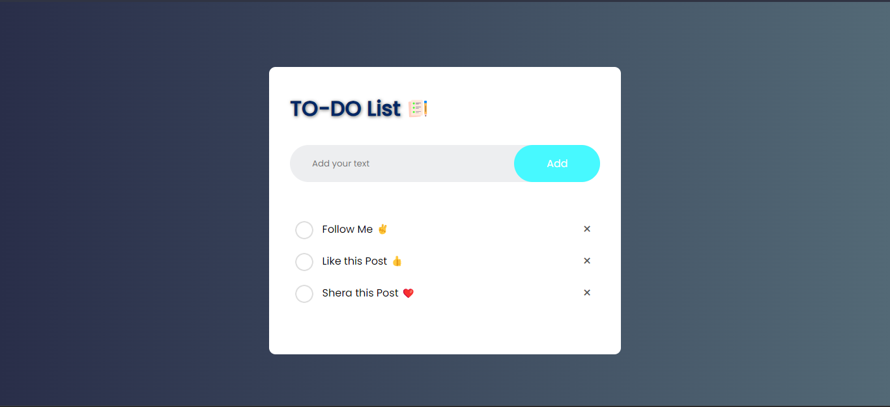

<<<<<<< HEAD
<h1 align='center'>To-Do List</h1>

A website for App To-Do List created with HTML & CSS & js!

🌱 I created this program to help me organize tasks, this is a joke, this program is very simple.

## Design Preview

## Live Demo
👁 [Click here](https://habashyabdulrahman.github.io/To-Do_List/) to check out the live demo!

## Technologies Used
* 
*  
*  

## Features
* ⭐ Can add our task list
* 👓 Mark that task as completed or incomplete.
* 🌱 We can write the new task in the input box and click on the "Add" button then the new task will be added to the  list.
* 🌐 We can click on the task name to mark it as completed or incomplete task.
* 🌍 We will add a close icon to delete the particular task from the ToDo list.
* ⚡ Fast and lightweight design
* 🤖 Responsive design on all devices

## Credits
* Fonts are from [Google Fonts](https://fonts.google.com)
* README Badges are from [Badges Profile](https://github.com/habashyabdulrahman)
